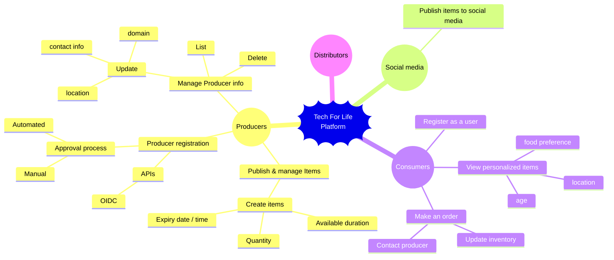
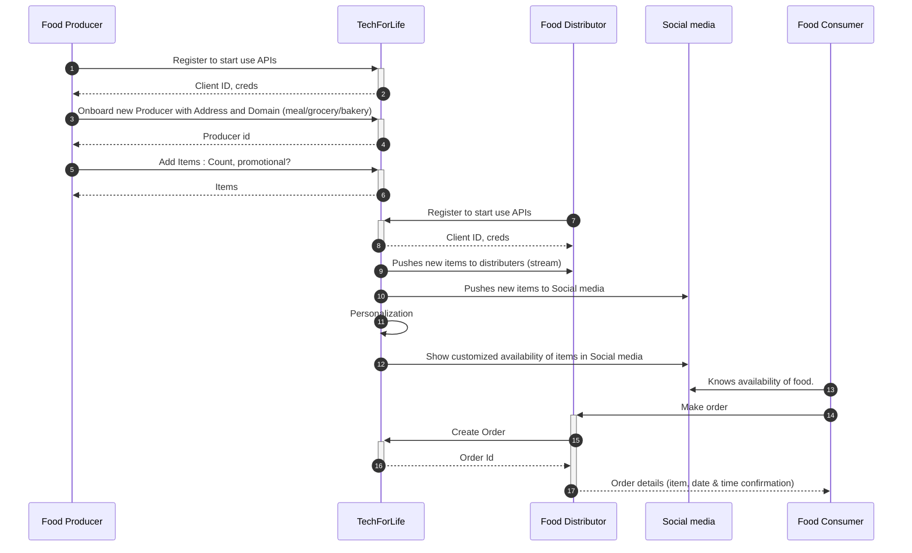

# techforlife

## Design

```mermaid
mindmap
    root )) Tech For Life <br/> Platform ((
        Producer ((Producers)) 
            Producer registration
                APIs
                    OIDC
                Approval process
                    Automated
                    Manual
            Manage Producer info
                List
                Update
                    domain
                    contact info
                    location
                Delete
            Publish & manage Items    
                Create items
                    Quantity
                    Available duration
                    Expiry date / time


        Social media ((Social media))
            Publish items to social media
            
        Consumers ((Consumers))
            Register as a user
            View personalized items
                location
                food preference
                age
            Make an order
                Update inventory
                Contact producer
        Distributors ((Distributors))        

```

```mermaid

sequenceDiagram
    autonumber
    participant prod as Food Producer
    participant sys as TechForLife
    
    participant dist as Food Distributor
    participant med as Social media
    participant con as Food Consumer

    prod ->>+ sys : Register to start use APIs
    sys -->>- prod : Client ID, creds  

    prod ->>+ sys : Onboard new Producer with Address and Domain (meal/grocery/bakery)
    sys -->>- prod : Producer id
    prod ->>+ sys : Add Items : Count, promotional?
    sys -->>- prod : Items
    
    dist ->>+ sys : Register to start use APIs
    sys -->>- dist : Client ID, creds  

    sys ->> dist : Pushes new items to distributers  (stream)
    
    sys ->> med : Pushes new items to Social media
    sys ->> sys : Personalization
    sys ->> med : Show customized availability of items in Social media

    con ->> med : Knows availability of food.
    con ->>+ dist : Make order
    dist ->>+ sys : Create Order
    sys -->>- dist : Order Id
    dist -->>- con : Order details (item, date & time confirmation)
```