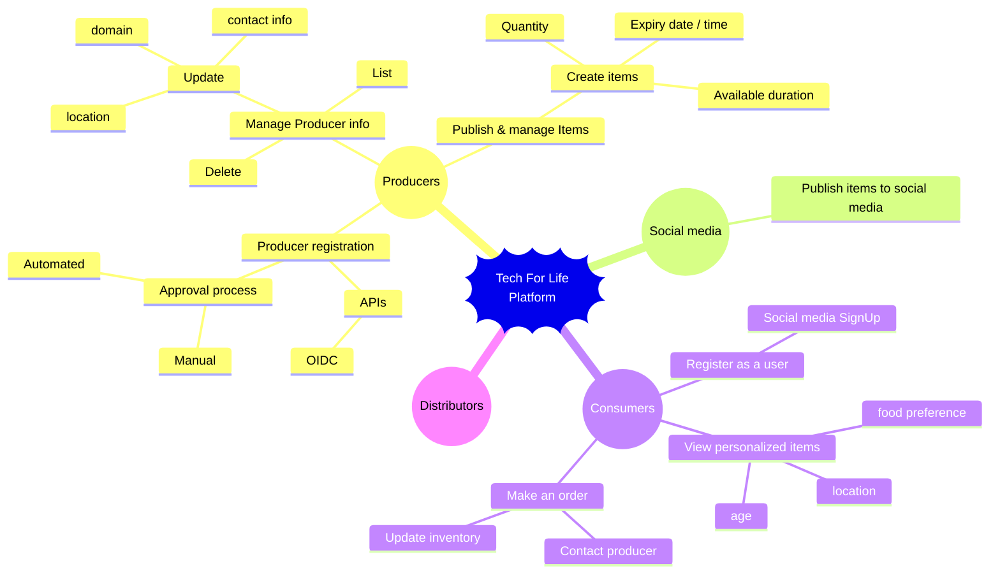
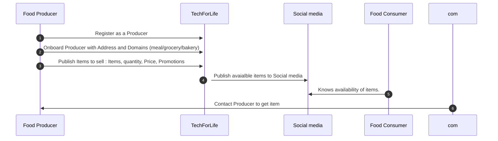

# techforlife

## Use casse - Mind Map

```mermaid
mindmap
    root )) Tech For Life <br/> Platform ((
        Producer ((Producers)) 
            Producer registration
                APIs
                    OIDC
                Approval process
                    Automated
                    Manual
            Manage Producer info
                List
                Update
                    domain
                    contact info
                    location
                Delete
            Publish & manage Items    
                Create items
                    Quantity
                    Available duration
                    Expiry date / time


        Social media ((Social media))
            Publish items to social media
            
        Consumers ((Consumers))
            Register as a user
                Social media SignUp
            View personalized items
                location
                food preference
                age
            Make an order
                Update inventory
                Contact producer
        Distributors ((Distributors))        

```

## Phase 1 - Social Media

```mermaid

sequenceDiagram
    autonumber
    participant prod as Food Producer
    participant sys as TechForLife
    participant med as Social media
    participant con as Food Consumer

    prod ->>+ sys : Register as a Producer
    prod ->>+ sys : Onboard Producer with Address and Domains (meal/grocery/bakery)
    prod ->>+ sys : Publish Items to sell : Items, quantity, Price, Promotions    
    sys ->> med : Publish avaialble items to Social media
    con ->> med : Knows availability of items.
    com ->> prod : Contact Producer to get item
```