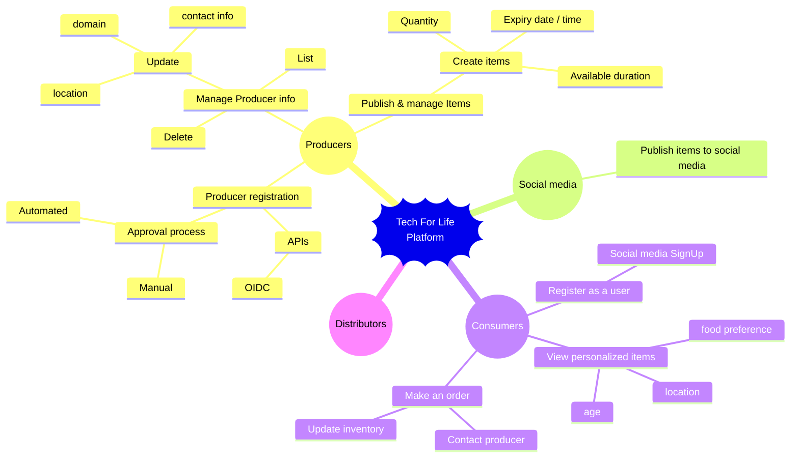

# techforlife

## Mind Map

## Phase 1
[Phase 1](phase-1.md)

## Architecture
- [Context Diagram](out/docs/c4-context-diagram/c4-context-diagram.png)
- [Component Diagram](out/docs/c4-component-diagram/c4-component-diagram.png)
- [Deployment Diagram - Tentative](out/docs/deployment/deployment.png)

## Reference
- https://chatgpt.com/share/f8eed893-1ccb-4f4e-bcfb-5788a989cb18
- https://chatgpt.com/share/e2f68719-e0a4-468d-bb91-62626fe3f51d
- [EKS to Confluent Kafka Cloud Connectivity](https://chatgpt.com/share/a3bb2d63-d77f-484c-8a19-920183efdee7)
- [Cognito and Google as IDP](https://chatgpt.com/share/a3bb2d63-d77f-484c-8a19-920183efdee7)
- [Cognito and ALB](https://chatgpt.com/share/a3bb2d63-d77f-484c-8a19-920183efdee7)
